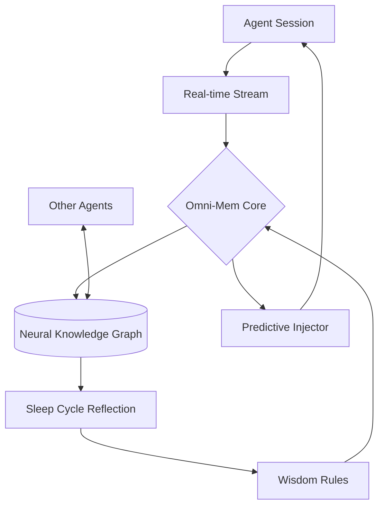

# ⚡ OMNI-MEM

> **"Stop treating your AI like a goldfish. Give it a prefrontal cortex."**

[](https://opensource.org/licenses/MIT)
[](https://github.com/thedotmack/omni-mem)
[](https://github.com/thedotmack/omni-mem)

---

## 🧠 The Paradigm Shift

Repositories like `claude-mem` treat memory as a **hard drive**—a place to dump logs, search text, and retrieve past context. This is fundamentally low-level and reactive.

**Omni-Mem** is an aggressive, god-tier cognitive architecture. It doesn't just "remember" what happened; it understands *why* it happened, predicts what you need next, and actively evolves the agent's reasoning capabilities across the entire enterprise ecosystem.

---

## 🚀 Key Cognitive Pillars

### 1. Meta-Cognitive Reflection (The Sleep Cycle)
After every session, Omni-Mem runs an asynchronous "sleep cycle." It reviews the agent's successes and failures, distills them into permanent **Wisdom Rules**, and permanently alters how the agent approaches future problems.

### 2. Zero-Prompt Intuition (The Clairvoyant Layer)
No more `search_memory` tool calls. Omni-Mem uses predictive streams to inject exactly the right context into the agent's working memory *before* the agent even asks. It feels like magic.

### 3. Regret Analysis (The Antibody)
Omni-Mem aggressively catalogs mistakes. If a UI design was rejected or a bug was introduced, it forms an **Anti-Pattern Antibody**, mathematically preventing the agent from walking down that same dead-end path again.

### 4. Global Swarm Telepathy
The central nervous system for your multi-agent team. If the Backend Agent learns a new API schema, the Frontend Agent instantly "knows" it. State is synchronized in real-time across your entire engineering swarm.

---

## 🛠️ Installation

Omni-Mem is designed for zero-friction hijacking of your CLI environment.

```bash
npx omni-mem init
```

*Compatible with Claude Code, Gemini CLI, Cursor, and OpenClaw.*

---

## 📐 Architecture



---

## 📜 Manifesto

Read the full [OMNI-MEM MANIFESTO](./MANIFESTO.md) to understand why we are building the future of agentic cognition.

---

## 🤝 Contributing

We only accept "God-Tier" contributions. If you want to help build the Prefrontal Cortex of the AI Era, check out [CONTRIBUTING.md](./CONTRIBUTING.md).

---

<p align="center">
  Built with ⚡ by the Omni-Mem Foundation.
</p>
